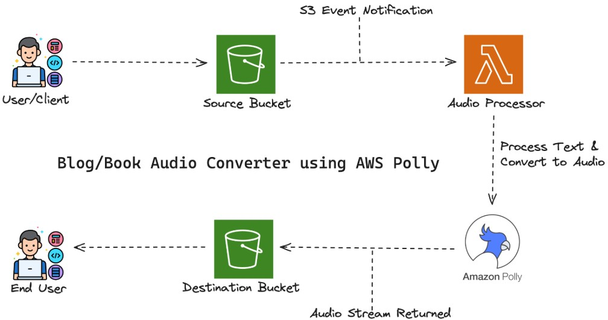

# Polly-Powered Audio Narrator — AWS Build

## Overview

This project converts text files (blog posts, articles, newsletters, or book excerpts) into speech using **Amazon Polly**. It automatically detects new `.txt` files uploaded to an S3 bucket, converts them to audio using AWS Polly's text-to-speech engine, and stores the resulting audio file in a destination S3 bucket.


## Architecture



**Flow:**
1. A `.txt` file is uploaded to the **source S3 bucket**.
2. This triggers an **S3 Event Notification**, which invokes a **Lambda function**.
3. The Lambda function reads the text file, sends it to **Amazon Polly** for speech synthesis.
4. Polly returns an audio stream, which the Lambda function writes to the **destination S3 bucket**.

## AWS Services Used

| Service | Purpose |
|---|---|
| Amazon S3 | Source and destination storage for text/audio files |
| AWS Lambda | Orchestrates the text-to-speech conversion |
| Amazon Polly | Converts text to natural-sounding speech |
| IAM | Manages permissions between services |

## Steps I Followed

### 1. Set Up an AWS Account

### 2. Created S3 Buckets
- **Source bucket:** `polly-source-bucket`
- **Destination bucket:** `polly-destination-bucket`

### 3. Created an IAM Policy
Granted permissions for S3 object access and Polly speech synthesis:

```json
{
  "Version": "2012-10-17",
  "Statement": [
      {
          "Effect": "Allow",
          "Action": [
              "s3:GetObject",
              "s3:PutObject"
          ],
          "Resource": [
              "arn:aws:s3:::polly-source-bucket/*",
              "arn:aws:s3:::polly-destination-bucket/*"
          ]
      },
      {
          "Effect": "Allow",
          "Action": [
              "polly:SynthesizeSpeech"
          ],
          "Resource": "*"
      }
  ]
}
```

### 4. Created an IAM Role
Attached the custom policy above plus `AWSLambdaBasicExecutionRole` to a new role.

### 5. Created and Configured the Lambda Function
- **Runtime:** Python 3.8
- **Execution role:** the IAM role created above
- **Environment variables:**
  - `polly-source-bucket` = name of source S3 bucket
  - `polly-destination-bucket` = name of destination S3 bucket

### 6. Configured S3 Event Notification
Set the source bucket to trigger the Lambda function on `ObjectCreated` events for files ending in `.txt`.

### 7. Wrote the Lambda Function Code
The function reads the uploaded `.txt` object, calls `polly.synthesize_speech()`, and writes the returned audio stream to the destination bucket.

### 8. Tested the System
Uploaded a sample `.txt` file to the source bucket and confirmed an `.mp3` file was generated in the destination bucket.

## Credit

Built following the tutorial by [yeshwanthlm](https://github.com/yeshwanthlm/Polly-Powered-Audio-Narrator). 
This repo documents my personal implementation and AWS setup.
